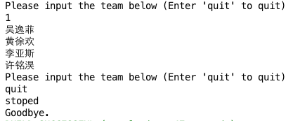
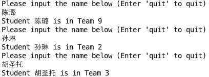
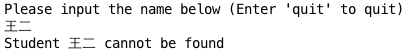
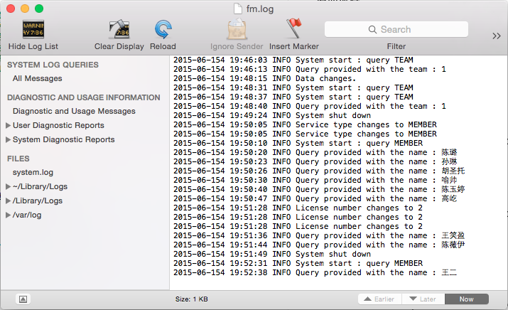

#Document
---
## 系统功能说明

+ 提供查询服务
	+ 用户输入组号，系统查询并返回该组成员名单
	+ 用户输入姓名，系统查询并返回该人所在小组
+ 系统记录如下数据
	+ 用户请求次数
	+ 系统提供服务次数
	+ 系统拒绝服务次数
+ 生成系统日志

##开发环境依赖

+ [CM.jar](https://github.com/TJSoftwareReuse/DeliverComponents/tree/master/CM/T9/1.0) - Team 9
+ [FM2.5.jar](https://github.com/TJSoftwareReuse/DeliverComponents/tree/master/FM/T2/1.0) - Team 2
+ [PM_v1.2.jar](https://github.com/TJSoftwareReuse/DeliverComponents/tree/master/PM/T9/1.2) - Team 9
+ [License.jar](https://github.com/TJSoftwareReuse/DeliverComponents/tree/master/License/T8/lastest_version) - Team 8
+ log4j-1.2.17.jar 

##系统配置

####配置文件路径

+ 配置文件路径为``config.properties``

####配置文件信息
	
	DATA_PATH=data.txt #数据文件路径
	FM_PATH=fm.log #fm构件输出文件路径
	PM_PATH=pm #pm构件输出文件路径
	PM_TIME=3000 #pm构件输出间隔时间段
	LICENSE_NUM=5 # License构件容量
	SERVER_TYPE=TEAM # 取值为TEAM或MEMBER，查询服务类型
	
####修改配置文件

+ 直接修改配置信息
+ 修改后不需重启系统

##数据导入

####数据文件路径

+ 在配置文件中 ``DATA_PATH`` 更改数据文件路径

####数据文件信息

+ 数据文件格式 ``Name:TeamMember\n``
+ 修改数据文件后需重启系统

##系统流程

#### 启动流程

1. 设置配置文件 (如果需要)
2. 启动系统
3. 开始查询

#### 查询流程

+ `SERVER_TYPE` = `TEAM`

	+ 

+ `SERVER_TYPE` = `MEMBER`

	+ 
	+ 
	
#### 日志文件

